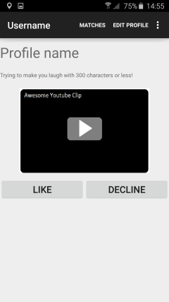

# Laughder

## Screens

So far only the backbone of the app has been implemented, such as the most important screens and the necessary intents to be able to switch between these screens.
Higher level functions as server capabilities or a chat function are not included so far.
Therefore, in this paragraph, I will talk about the function that still need implementing, with screenshots of the app so far to guide us.
Which of these functions I consider to be necessary for the minimum viable product will be tackled later on in this document.

This is the first screen of the app. New users of the app will be confronted with this screen and will have the option to either register, or log in with an already existing account.
For now, only the login button is implemented, as registering will require saving information on a server. In later stages of the app, registering will redirect the user to a profile making/editting page.
As of now, the user will need to fill in something in both edit text fields, since the app will not continue if either space is not filled in. Instead, it will display a toast requesting the user to fill in both boxes.
If the user complies the app will switch to the BrowseActivity.

This screen will show the user a random profile of another user. This profile will contain a text of maximum 500 characters, and a embedded youtube clip.
In later stages of the app extra profile information might be implemented, like for example a voice clip, or an imgur link.
The user will then be able to like or decline the profile. Declining will refresh the screen with a new userprofile. Liking it will add the relevant user to their match screen.

This is the MatchActivity, that displays all the past matches a user has had. He can then decide to chat with them, or delete them. 
Chatting with them will open a standard chat window, deleting them will remove that specific entry from the match screen.
If a person replies to the user, push notifications will be displayed on the phone, notifying the user of his or her new messages.
Clicking on the name of the match will allow the user to revisit the profile of the relevant person.

Lastly, a user will be able to edit his or her own profile. That screen will look roughly like this:

As you can see this is a very straightforward screen. The user is shown several edit text fields and can edit them as he or she wishes.
Editting them will update the entry on the server.

## Functions that need implementing

From this all we can conclude that the main functions that still need implementing are a server that can store account and profile details, and a chat function.
For the former I will be using the Parse API. This will allow the app to store information such as account name, passwords, and profile information remotely and securely.
The chat function will likely use the Layer API, since Parse and Layer apparently work very well together.
Since working with this high level API's is new to me, I expect this to be the main time consumer on this project.
I will need to fully understand how both API's work before I can use them. 
However, by now I'm fairly comfortable using android studio and java, so I expect the implementing part to go rather smoothly.

## MVP

My minimum viable product must allow users to register accounts and log in the app once accounts are made. 
Furthermore users must be able to make their own profile, containing only text and a YouTube URL.
Next, users must be able to browse profiles randomly and like or decline them, depending on whether the profile was able to make them laugh.
Profiles will need to be able to display the text in a visually pleasing manner, and must be able to embed the YouTube URL for one-click playing.
Last but not least, users should be able to see their matches and chat with them or revisit their profile.

This means that the following functions are not considered necessary for my MVP:

	- Push notifications.

	- Location based matching of profiles.

	- Voice, emoji, and image support in the chat function.

	- Being able to upload text from an external file like a .doc or .pdf for the text part of the profile.

These functions will only be implemented if there is time left at the end of this course.
