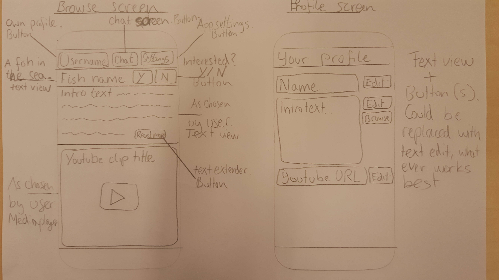
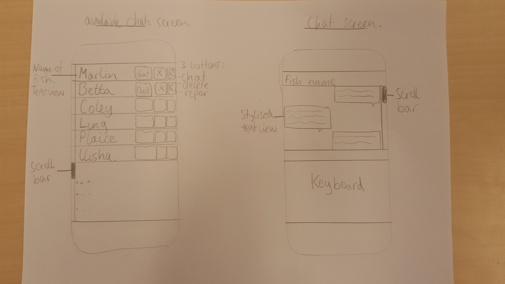

# Laughder

## Short introduction

A dating app where matches are based on whether you can make eachother laugh.

## Idea description

After recently having entered the dating-scene I decided to try out some of the online dating apps that were available.
Online dating apps have been popularised in the last couple of years by apps like tinder, after they were previously stigmatised as being an inpersonal way of meeting new people.
The ease of use however quickly convinced users to give it a try, and soon dating culture was considerably altered.
In my opinion, the low threshhold of dating apps, allowing users to start of with a 'just giving it a try' attitude, is what helped them became popular.
Nowadays, 2 years after the popularization of Tinder, dating apps are no longer just an easy way to meet local singles. They have also proved their worth in finding long-term partners.
It is this change that had led to a gap in user experience. 
Many people, including my self, are not particularly interested in quick one-night stands, but are still fond of the low threshhold way of meeting new people.
Considering this approach to dating apps, the importance of physical attraction becomes less leading (assuming that physical attraction is more important in one-night stands than in long term relationships).
This gap has been attempted to be filled by many competitors on the market. For example, Paiq exposes its users to extensive personality testing, and bases matches on the results.
In my personal experience however, I find that the best predictor of whether a relationship will work, is being able to make each other laugh (note: this is not quite the same as having the same sense of humor).
That is how Laughder will attempt to fill the aforementioned gap.
Of course, physical attraction is still a relevant factor, but it will only make up a small part of the matchmaking proces, for example via a questionaire that users can fill in when first making a profile.

## Necessary features

- Laughder will need to be able to match people remotely, so there will have to be a database of users.

- Laughder will need to be able to search through this database (taking user preferences as described in the 'welcome questionnaire' into account) and display one profile at a time to the user, allowing the user to 'swipe left' or 'swipe right'.

- Laughder will need to keep track of seen profiles as to not offer the user duplicate profiles.

- Laughder will need to include a simple chat functionality so mathced users can communicate.

- Laughder users will need to be able to customize their profile, in which they should be able to embed certain media and add (long) pieces of text.
	- Therefore, Laughder will need to include a simple mediaplayer that can play youtube videos. This feature can be dropped if the deadline is threatened to be missed.
	And
	- Laughder users will need to be able to import text from word documents or pdf, since writing long pieces of text on mobile is not user friendly.

## Data sets

Profiles will be saved in a file containing the Username, their intro text (with a rough max of 1000 words), and a youtube link.
More features could potentially be added later.
Furthermore, user information will be saved in a file or multiple files as well. This file will contain data such as what profiles they have previously viewed, what profiles they have been matched with, etc.

## Screens

- There will be a 'Matchmaking' screen where users are displayed another user's profile. This will likely not fit in one screen, so there will likely be buttons to open the different parts of someone's profile.

  The 'Matchmaking' screen will also include buttons that will mimick Tinder's 'swipe right' and 'swipe left' functionality. Later version might be able to fully copy this mechanic.

- Users must also be able to edit their own profile, so there should be a 'Edit profile' screen, which will display a user's own profile and include buttons to edit this information. Furthermore, the text part of the profile should be importable from the harddrive of the android product.

- Users that are matched should be able to communicate with each other, therefore there must be a chat functionality. This will include two screens:
	- The first should display a user's matches, allowing them to select them and to either open a chat window with them or delete them from their match history.
	- The second will be a simple chat window, preferably with access to emoticons.

- Last but not least there should be a settings page, allowign the user to change matchmaking criteria's, and other things that will eventually pop up during the proces of making the app.

The first four screens have been roughly sketched in the following images. The settingsscreen will be completely vanilla.

## Short review of inspirational app

Laughder will be very similair to Tinder. For example, both apps will have the same 5 screens.
Profiles are made up of almost exclusively pictures, and therefore the visual aspect is a lot more important. Laughder will attempt to be more information dense without negatively affecting user experience. This will pose a big challenge.

## Necessary API

Laughder will make sue of Parse for its server use. As explained on the Parse site:
> The Parse platform provides a complete backend solution for your mobile application. Our goal is to totally eliminate the need for writing server code or maintaining servers. 
This will leave more room to improve on the frontend asepcts of the app.