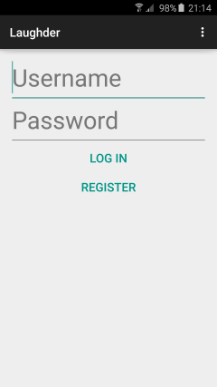

# Laughder

## Short introduction

A dating app where matches are based on whether you can make eachother laugh with text and a youtube clip.

## Idea description

After recently having entered the dating-scene I decided to try out some of the online dating apps that were available.
Online dating apps have been popularised in the last couple of years by apps like tinder, after they were previously stigmatised as being an inpersonal way of meeting new people.
The ease of use however quickly convinced users to give it a try, and soon dating culture was considerably altered.
In my opinion, the low threshhold of dating apps, allowing users to start of with a 'just giving it a try' attitude, is what helped them became popular.
Nowadays, 2 years after the popularization of Tinder, dating apps are no longer just an easy way to meet local singles. They have also proved their worth in finding long-term partners.
It is this change that had led to a gap in user experience. 
Many people, including my self, are not particularly interested in quick one-night stands, but are still fond of the low threshhold way of meeting new people.
Considering this approach to dating apps, the importance of physical attraction becomes less leading (assuming that physical attraction is more important in one-night stands than in long term relationships).
This gap has been attempted to be filled by many competitors on the market. For example, Paiq exposes its users to extensive personality testing, and bases matches on the results.
In my personal experience however, I find that the best predictor of whether a relationship will work, is being able to make each other laugh (note: this is not quite the same as having the same sense of humor).
That is how Laughder will attempt to fill the aforementioned gap.
Of course, physical attraction is still a relevant factor, but it will only make up a small part of the matchmaking proces, for example via a questionaire that users can fill in when first making a profile.

## Necessary features for market launch

	- Laughder users are able to match people remotely, so there a database of users has been implemented.

	- Laughder users are able to search through this database and display one profile at a time to the user, allowing the user to 'swipe left' or 'swipe right'.

	- Laughder will (eventually) keep track of seen profiles as to not offer the user duplicate profiles.

	- Laughder will (eventually) include a simple chat functionality so matched users can communicate.

	- Laughder users are able to customize their profile, in which they can embed certain media and add (long) pieces of text.
		- Therefore, Laughder should eventually include a simple mediaplayer that can play youtube videos. This feature has be dropped due to time shortage.
		And
		- Laughder users should eventually be able to import text from word documents or pdf, since writing long pieces of text on mobile is not user friendly. This to has been dropped.

## Data sets

For user registration, user log in, and user profiles functions I have used the Parse API. This grants me access to an encrypted database where I can store ParseUser objects. As explained on the Parse site:

> The Parse platform provides a complete backend solution for your mobile application. Our goal is to totally eliminate the need for writing server code or maintaining servers. 

These ParseUsers have several key value pairs. For example, a "userName" key, that stores the object's username as its value.
Every user also has a key value pair for every user they have previously judged. Their choise, either like or decline, is stored as and integer value, so a 1 or 0 respectively.
Lastly, every ParseUser object has a "matches" key, that has an arraylist as its value, that stores all user IDs of the users that have matched with the current user. 
Matches are of course established when user A has a 1 for user B, and user B has a 1 for user A.

## Screens

Before going into further detail about my design choices and what features have been either implemented or dropped, I will first walk through the different screens of the app.

	- The first screen that users see is of course the 'Log in' screen. In this screen users can either fill in their username and password and click the log in button, or they can click the register button that will redirect them to the register screen.

	- The 'Register' screen allows users to create a new user. To do this, all edit texts need to be filled in, and the password screens need to be identical.

	- There is a 'Browse' screen where users are displayed another user's profile. This screen will also include buttons that will mimick Tinder's 'swipe right' and 'swipe left' functionality. Later version might be able to fully copy this mechanic, or implement it in a different fashion.
	The random profiles are found by creating a list of all parse users, filtering out its own profile, and then choosing a random entry in the list.

	- The 'Matches' screen is created by an adapter that finds all the ParseUser objects associated with the userID's stored in the 'matches' array.
	The adapter then pulls the "userName" and "phoneNumber" values from these objects, and displays them in seperate items.

	- Users are able to edit their own profile, so there is a 'Edit profile' screen, which displays a user's own profile and includes edit texts that load the relevant strings.
	If these string are not found, the calls will return 'null', meaning that the edit texts will appear empty and display their hints.
	If the youtubelink edittext does not contain the substring 'youtu' a toast will be displayed letting the user know that this is not a valid youtube link.
	If this condition is met however, the user will be shown a 'profile saved' toast.

## Short review of, and comparison with, inspirational app: Tinder

Laughder is based in essence on Tinder. For example, both apps have similair screens and functionalities.
Tinder profiles are however made up of almost exclusively pictures, and therefore the visual aspect is a lot more important. 
Laughder hopes to be more information dense without negatively affecting user experience, since Laughder is aimed at a different market than Tinder.

## Features that have been implemented

Users can log in and register for this app, and there is a clear divide between the pre-login or pre-register part of the app and the post-login part of the app (if my bug checking has been thorough enough). 
Users should not be able to stumble into the Browse screen unregistered for example.
Users can also go back to pre-login state via the log out button.

Furthermore, the app allows users to search through the database of users randomly, giving them the option to like or decline the user they are judging.
If the user is liked, and that specific user has also liked the current user, then a match is established, and phone numbers will be passed to eachother via the matches screen.

Lastly, users can edit their own profiles, allowing them to alter their text, phone number, and youtube link. Currently, only the youtube link is partially checked for authenticity.

## Features that have been dropped due to time shortage

The largest missing feature is of course the implementation of the youtube fragment. The browse screen is currently not visiually satisfying, and the youtube fragment could have made a big difference to that.
However, the effect on the functionality of the app is arguably minimal. Clicking the link will open the youtube app (or the browser) in a seperate screen, allowing users to watch the clip and returing to the app with the back button.

The biggest dissapointment in respects to user friendliness is in the omission of the chat functionality. This too turned out to be too much work in the last week, and was therefore replaced with the addition of phone numbers.
Users will now have to add their phone numbers at registration, and these numbers will only be displayed to their matches.
The reason why this is bad for user experience is because, in its current state, users will need to memorise the number, and manually add it to their phonebook to be able to contact their matches.
Ideally, the chat should have been internal to the app, but at least the numbers should ahve been addable with one click if the chat were to be left external to the app.

Lastly, the random profile searcher is currently unable to filter out previously viewed profiles. However, this was purposively done.
Since the current userbase is only 5 at this time, showing off the app would be nigh impossible, since there would be no more profiles left to display after 4 clicks.
The app can however filter out its own profile, and I am therefore confident that I could easily implement further filters if the userbase were to make this necessary.

One of the main reasons why these features were dropped was due to time shortage. I am fairly confident that I will be able to implement these features at a later stage, and by myself.
However, I have found that implementing features is only about 50% of the work. The other 50% is spent in tweaking: Fixing bugs, upgrading visuals, smoothen the edges, etc.

## Challenges along the way

The hardest part about this course and the making of this app for me personally have been being able to spend relatively large amounts of time working on one thing.
My personality is not quite suited to this work approach, since I lack the capability for monotropism.
I think I would be better suited working in a less stringent environment where I could focus on both the development aspects and the equally crucial team building aspects of app development.

All of this aside, in respects to coding, my largest challenge has probably been to implement the list adapter. I struggle to work with less thoroughly documented, and in my eyes, more abstract methods such as custom list adapters.
Apart from that, I also found it very hard to extract code out of my activities and into seperate classes.
The reason for this is because I have no trouble overseeing my own chaos, and am therefore demotivated to put in the necessary effort. I'm terrible at being productive without motivation.
Adding comments in my code on the other hand is not much of an effort, and it adds more to the readability of the code in my mind, so the effort / benefit cost is less for me. So I have no trouble doing that.

Lastly, I am absolutely terrible at maintaining a regular work schedule. Not for the classical student reasons however, but simply because I am currently very sensitive to being in a pleasant work environment, and unfortunately, home is one of the only environments I truly consider pleasant.

